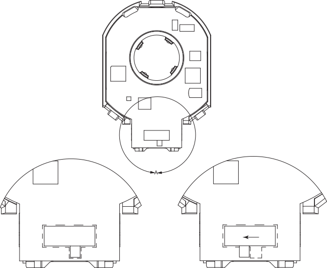
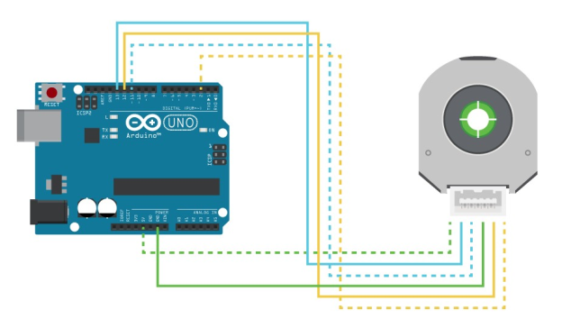
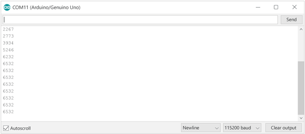
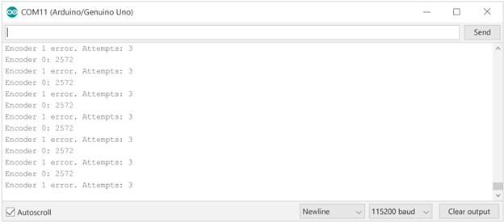

# AMT22 Arduino SPI Sample Code

## Table of Contents

- [Hardware](#hardware)
- [Software Required](#software)
- [AMT22 Encoders](#amt22-encoders)
- [Setup](#setup)
- [Circuit](#circuit)
- [AMT22 Commands](#amt22-commands)
- [Code Tutorial](#code-tutorial)
  - [Includes and Defines](#includes-and-defines)
  - [Initialization](#initialization)
  - [SPI Communication](#spi-communication)
  - [Checksum Verification](#checksum-verification)
  - [Data Formatting](#data-formatting)
  - [Set Zero Position](#set-zero-position-single-turn-only)
  - [Read Turns Counter](#read-turns-counter-multi-turn-only)
  - [Running the Code](#running-the-code)
  - [Multiple Encoders](#multiple-encoders)

## Hardware

- [Arduino board](https://www.arduino.cc/en/hardware)
- [AMT22 encoder](https://www.cuidevices.com/product/motion-and-control/rotary-encoders/absolute/modular/amt22-series)
- [AMT-06C-1-036 cable](https://www.cuidevices.com/product/motion-and-control/rotary-encoders/encoder-accessories/amt-cables/amt-06c-1-036), or similar cable with proper connector
- [AMT programming module](https://www.cuidevices.com/product/motion-and-control/rotary-encoders/encoder-accessories/amt-cables/amt-pgrm-06c) *optional, for updating firmware*

## Software

- [Arduino IDE](https://www.arduino.cc/en/Main/Software)
- [AMT22 Arduino Sample Code](https://github.com/cuidevices/AMT22_SPI_Sample_Code_Uno)
- [AMT Viewpoint](https://www.cuidevices.com/amt-viewpoint) *optional, for updating firmware*

## AMT22 Encoders

The AMT22 is an absolute encoder available with either 12-bit or 14-bit resolution. This means that over a single revolution, the encoder will have that many distinct positions. For a 12-bit encoder there are 4096 distinct positions, and for a 14-bit encoder there are 16384 positions. No matter how many times the device is rotated, the encoder will always know its absolute position. Knowing the absolute position means that you will always know the exact angle of the device.

The AMT22 comes in both single-turn and multi-turn variants. The single-turn variants keep track of the position within a single rotation (i.e.: 0-360°). The multi-turn variants also count the number of complete rotations that the encoder has passed through. The single-turn variants also have a programmable zero point, allowing you to define where the encoder should have its origin.

## Setup

You may want to ensure that the AMT22 encoder has the latest firmware. You can use the programming module for the AMT22 and our AMT Viewpoint software to verify the encoder firmware is up-to-date.

After confirming the encoder has the correct firmware, put the encoder into RUN mode by moving the switch on the back of the encoder to the proper position.



Now mount the AMT22 encoder to your motor or assembly using the [AMT mounting instructions](https://www.cuidevices.com/amt-mounting) to ensure proper installation.

## Circuit

The following connections are for the [Arduino Uno board](https://store.arduino.cc/products/arduino-uno-rev3), however, most all Arduino boards will be compatible with this code. The connections to various Arduino boards will be different than this example, so consult Arduino documentation for additional information.



| Function | Encoder Pin Number | Arduino Uno Pin | AMT-06C-1-036 Color |
| ----------- | ----------- | ----------- | ----------- |
| +5V | 1 | 5V | White/Green |
| SCLK | 2 | 13 | Blue/White |
| MOSI | 3 | 11 | White/Blue |
| GND | 4 | GND | Green/White |
| MISO | 5 | 12 | Orange/White |
| CS | 6 | 2 | White/Orange |

## AMT22 Commands

The AMT22 begins transmitting the absolute position immediately when SPI begins transferring data, preventing the need for a command and response structure. Therefore, the host will send 0x00 as the first byte, with valid data being returned at the same time. As a result, if the host wants to send a zero command, it will go on the second transmitted byte. We call this an extended command. For more information, please reference the [AMT22 datasheet](https://www.cuidevices.com/product/resource/amt22.pdf).

| Command | Byte | Notes |
| ----------- | ----------- | ----------- |
| Get Position | 0x00 0x00 |  |
| Set Zero | 0x00 0x70 | Single-turn only |
| Get Turns | 0x00 0xA0 | Multi-turn only |

## Code Tutorial

### Includes and Defines

Since we are using the Arduino’s SPI bus, we need to include the SPI library.

To get the position from the Arduino to the computer, we will use the built-in USB-serial connection to the Arduino IDE, with a baud rate of 115200. We should also define the commands used by the AMT22. Because the encoder does not care about the content of the first byte, we will define it as a NOP (no-operation).

We also want to use defines at the top for the SPI pins. This way, if the code needs to be modified for a different board or we want to change which pins we use, it can easily be done here in one place. It is not necessary to define the main pins for SPI communication, but it is helpful to do as a reference.

```c
/* Include the SPI library for the arduino boards */
#include <SPI.h>

/* Serial rates for UART */
#define BAUDRATE      115200

/* SPI commands */
#define AMT22_NOP     0x00
#define AMT22_ZERO    0x70
#define AMT22_TURNS   0xA0
```

### Initialization

In the `setup()` function, we will initialize all of our SPI pins and set up our serial interfaces.

We also need to initialize the serial port so we can get data back to the host computer. We will do that by feeding the `Serial.begin()` function to our defined `BAUDRATE`.

Before initializing SPI, we should also make sure the chip select line is in the proper state. And lastly, to use the SPI bus with the AMT22 we need to select a clock rate. For prototyping we will use 500 kHz, but the encoder works up to 2 MHz. We will do this by using the SPI clock divider. The UNO has a clock rate of 16 MHz, so by using the `SPI_CLOCK_DIV32` value we get a clock rate of 500 kHz. Please reference Arduino documentation for more information.

Once everything is configured, it is okay to begin the SPI bus, which will configure the 3 dedicated SPI pins (MISO, MOSI, SCLK).

```c
void setup()
{
  uint8_t cs_pin = 2;

  //Set the modes for the SPI CS
  pinMode(cs_pin, OUTPUT);
  //Get the CS line high which is the default inactive state
  digitalWrite(cs_pin, HIGH);

  //Initialize the UART serial connection for debugging
  Serial.begin(BAUDRATE);

  //set the clockrate. Uno clock rate is 16Mhz, divider of 32 gives 500 kHz.
  //500 kHz is a good speed for our test environment
  //SPI.setClockDivider(SPI_CLOCK_DIV2);   // 8 MHz
  //SPI.setClockDivider(SPI_CLOCK_DIV4);   // 4 MHz
  //SPI.setClockDivider(SPI_CLOCK_DIV8);   // 2 MHz
  //SPI.setClockDivider(SPI_CLOCK_DIV16);  // 1 MHz
  SPI.setClockDivider(SPI_CLOCK_DIV32);    // 500 kHz
  //SPI.setClockDivider(SPI_CLOCK_DIV64);  // 250 kHz
  //SPI.setClockDivider(SPI_CLOCK_DIV128); // 125 kHz

  //start SPI bus
  SPI.begin();
}
```

### SPI Communication

SPI calls are done with the SPI library of the Arduino, but the chip select of devices is controlled by us in code using the digital IO pins. We use the `digitalWrite()` function to do this.

The AMT22 expects two bytes of 0x00 to be sent and it returns data immediately with those two bytes. Because of this fast response there are some minimum timing requirements that should be observed, please see the datasheet for more information.

It does not matter if the encoder has a resolution of 12-bits or 14-bits, it will always respond with two full bytes totaling 16 bits. The upper two bits are check-bits that allow us to confirm the data’s integrity. If the encoder is a 12-bit version, the bottom two bits will both be 0. For this data to be useful it must be shifted right 2 bits (or divided by 4).

We want to call the  `SPI.transfer()` function, sending the `AMT22_NOP` command. We will leave CS low. The high byte comes first, so in a single line of code we will call the function, shift it left 8 bits to get that first byte (8 bits) into the top half of the uint16_t variable, and assign it to `currentPosition`. We need to put a small delay to meet the AMT22 timing requirements, but then we can send the follow-up command. Again doing this in a single line, we are calling the  `SPI.transfer()` command, sending it `AMT22_NOP`, OR'ing the value with the currentPosition variable, and then telling it to release the CS line; this combines the two bytes received from the encoder in a single uint16_t variable.

```c
uint8_t cs_pin = 2;

//set the CS signal to low
digitalWrite(cs_pin, LOW);
delayMicroseconds(3);

//read the two bytes for position from the encoder, starting with the high byte
uint16_t encoderPosition = SPI.transfer(AMT22_NOP) << 8; //shift up 8 bits because this is the high byte
delayMicroseconds(3);
encoderPosition |= SPI.transfer(AMT22_NOP); //we do not need a specific command to get the encoder position, just no-op

//set the CS signal to high
digitalWrite(cs_pin, HIGH);
```

### Checksum Verification

Now that we have completed the SPI transfer, we need to validate the data using the checksum.

Using the equation from the datasheet, we can create a function to verify that the received value has a valid checksum. The checksum is stored in the upper two bits of the received value. The check-bits are odd parity over the odd and even bits in the position response. So, we will check for parity against all the odd bits (bit 1, 3, 5, 7, 9, 11, 13) and parity against even (0, 2, 4, 6, 8, 10, 12, 14).

This function will return `true` if the checksum is valid.

```c
/*
 * Using the equation on the datasheet we can calculate the checksums and then make sure they match what the encoder sent.
 */
bool verifyChecksumSPI(uint16_t message)
{
  //checksum is invert of XOR of bits, so start with 0b11, so things end up inverted
  uint16_t checksum = 0x3;
  for(int i = 0; i < 14; i += 2)
  {
    checksum ^= (message >> i) & 0x3;
  }
  return checksum == (message >> 14);
}
```

### Data Formatting

If the check-bits are correct, then we want to update the `currentPosition` variable, stripping out the upper two bits. We AND our `currentPosition` variable with 0x3FFF (0b0011111111111111) to make sure we retain all 14 lower bits.

We also need to check the handle whether the encoder resolution is 12-bit or 14-bit. If the resolution is 12-bits, then simply shift `currentPosition` 2 bits to the right.

```c
if (verifyChecksumSPI(encoderPosition)) //position was good
{
  encoderPosition &= 0x3FFF; //discard upper two checksum bits
  if (RESOLUTION == 12) encoderPosition = encoderPosition >> 2; //on a 12-bit encoder, the lower two bits will always be zero

  Serial.print(encoderPosition, DEC); //print the position in decimal format
  Serial.write('\n');
}
else //position is bad
{
  Serial.print("Encoder position error.\n");
}
```

### Set Zero Position (single-turn only)

Some AMT22 variants support a programmable zero position. Setting the zero position of the encoder means sending the two-byte command sequence. First, send the `AMT22_NOP` command, wait the minimum amount of time required by the AMT22, and send the `AMT22_ZERO` command, making sure to release the chip select line. Once the command is received the encoder will complete a reset. To make sure we are not talking to the encoder during this power on time we will implement a delay of 250 ms to be safe.

We can have our code set the zero position of the encoder first if we want, however, in normal applications you would only set the zero position once when configuring the device for use in the system.

```c
/*
 * The AMT22 bus allows for extended commands. The first byte is 0x00 like a normal position transfer,
 * but the second byte is the command.
 * This function takes the pin number of the desired device as an input
 */
void setZeroSPI(uint8_t cs_pin)
{
  //set CS to low
  digitalWrite(cs_pin, LOW);
  delayMicroseconds(3);

  //send the first byte of the command
  SPI.transfer(AMT22_NOP);
  delayMicroseconds(3);

  //send the second byte of the command
  SPI.transfer(AMT22_ZERO);
  delayMicroseconds(3);

  //set CS to high
  digitalWrite(cs_pin, HIGH);

  delay(250); //250 millisecond delay to allow the encoder to reset
}
```

### Read Turns Counter (multi-turn only)

Some AMT22 variants support a multi-turn counter. Instead of reading just the position, as above, we can read both the position and the turns count in a single sequence.

If the position is bad, let the user know there was an error. If the position is good, simply report the position in the decimal format.

```c
uint8_t cs_pin = 2;

//set the CS signal to low
digitalWrite(cs_pin, LOW);
delayMicroseconds(3);

//read the two bytes for position from the encoder, starting with the high byte
uint16_t encoderPosition = SPI.transfer(AMT22_NOP) << 8; //shift up 8 bits because this is the high byte
delayMicroseconds(3);
encoderPosition |= SPI.transfer(AMT22_TURNS); //we send the turns command (0xA0) here, to tell the encoder to send us the turns count after the position

//wait 40us before reading the turns counter
delayMicroseconds(40);

//read the two bytes for turns from the encoder, starting with the high byte
uint16_t encoderTurns = SPI.transfer(AMT22_NOP) << 8; //shift up 8 bits because this is the high byte
delayMicroseconds(3);
encoderTurns |= SPI.transfer(AMT22_NOP);
delayMicroseconds(3);

//set the CS signal to high
digitalWrite(cs_pin, HIGH);
```

### Running the Code

Now that our code has been created, we can load it onto the Arduino and get talking to an encoder. Open the serial monitor, make sure the data rate is set to 115200, and see the encoder work.



### Multiple Encoders

One benefit of an SPI device is that you can talk to multiple encoders on the same bus. To do this we will need to allocate another digital IO pin, and modify our functions to accept the pin number of the device we want to talk to.

In the example code, we use an array of CS pins, to allow any arbitrary number of encoders to be used.

```c
uint8_t cs_pins[] = {2}; //only one encoder connected, using pin 2 on arduino for CS
//uint8_t cs_pins[] = {2, 3}; //two encoders connected, using pins 2 & 3 on arduino for CS
```

We then loop over each CS pin and read the position from each connected encoder.

```c
void loop()
{
  for(int encoder = 0; encoder < sizeof(cs_pins); ++encoder)
  {
    uint8_t cs_pin = cs_pins[encoder];

    //set the CS signal to low
    digitalWrite(cs_pin, LOW);
    delayMicroseconds(3);

    //read the two bytes for position from the encoder, starting with the high byte
    uint16_t encoderPosition = SPI.transfer(AMT22_NOP) << 8; //shift up 8 bits because this is the high byte
    delayMicroseconds(3);
    encoderPosition |= SPI.transfer(AMT22_NOP); //we do not need a specific command to get the encoder position, just no-op

    //set the CS signal to high
    digitalWrite(cs_pin, HIGH);

    if (verifyChecksumSPI(encoderPosition)) //position was good, print to serial stream
    {
      encoderPosition &= 0x3FFF; //discard upper two checksum bits
      if (RESOLUTION == 12) encoderPosition = encoderPosition >> 2; //on a 12-bit encoder, the lower two bits will always be zero

      Serial.print("Encoder #");
      Serial.print(encoder, DEC);
      Serial.print(" position: ");
      Serial.print(encoderPosition, DEC); //print the position in decimal format
      Serial.write('\n');
    }
    else //position is bad, let the user know how many times we tried
    {
      Serial.print("Encoder #");
      Serial.print(encoder, DEC);
      Serial.print(" position error.\n");
    }
  }

  //For the purpose of this demo we don't need the position returned that quickly so let's wait a half second between reads
  //delay() is in milliseconds
  delay(500);
}
```

After data is transferred there is a minimum time before the chip select line can be released. This is specified in the datasheet as 3 microseconds. For slower data rates this is observed naturally, but we will implement it anyways.


